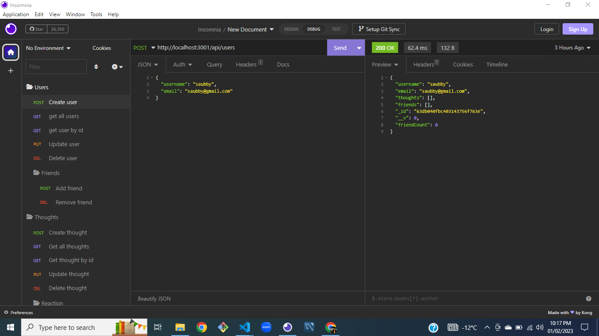

# NoSQL-Social-NetwokAPI

## Description

An API for a social network web application where users can share their thoughts, react to friends’ thoughts, and create a friend list.

## User Story

```md
AS A social media startup
I WANT an API for my social network that uses a NoSQL database
SO THAT my website can handle large amounts of unstructured data
```

## Acceptance Criteria

```md
GIVEN a social network API
WHEN I enter the command to invoke the application
THEN my server is started and the Mongoose models are synced to the MongoDB database
WHEN I open API GET routes in Insomnia for users and thoughts
THEN the data for each of these routes is displayed in a formatted JSON
WHEN I test API POST, PUT, and DELETE routes in Insomnia
THEN I am able to successfully create, update, and delete users and thoughts in my database
WHEN I test API POST and DELETE routes in Insomnia
THEN I am able to successfully create and delete reactions to thoughts and add and remove friends to a user’s friend list
```

## Rcording/Screenshots

The following animations show examples of the application's API routes being tested in Insomnia.

The following animation shows GET routes to return all users and all thoughts being tested in Insomnia:


The following shows Users and Friends screenshot of insomia.



The following shows Thoughts and Reactions screenshot of insomia.


## Deployment

https://github.com/saubby/NoSQL-Social-NetwokAPI

